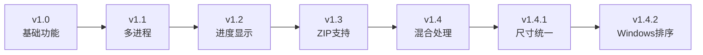

# 图片转PDF工具集

支持将图片文件夹和ZIP压缩包中的图片批量转换为PDF文件。项目包含多个版本，从基础功能到高级特性逐步演进。

## ✨ 核心特性

### 🎯 多源支持
- **📁 文件夹处理**: 批量处理文件夹中的图片文件
- **🗜️ ZIP压缩包**: 直接从ZIP文件提取图片，无需解压
- **🔄 混合处理**: 同时处理文件夹和ZIP文件

### 🚀 高级功能
- **📊 Windows风格排序**: 仿照Windows资源管理器的自然排序算法，支持中英文混合排序
- **🔢 智能数字排序**: 正确处理数字序列（1.jpg, 2.jpg, 10.jpg），避免字典序问题
- **🖼️ 格式兼容**: 支持JPG、PNG、BMP、GIF、TIFF、WebP等主流格式
- **🎨 自动转换**: 智能处理CMYK、RGBA、调色板等颜色模式
- **📏 尺寸统一**: 可选的图片尺寸标准化功能
- **⚡ 并行处理**: 多进程支持，充分利用多核CPU
- **📈 进度跟踪**: 实时显示处理进度和状态

### 🛡️ 稳定性保障
- **🔧 错误恢复**: 单文件失败不影响整体处理
- **💾 内存管理**: 自动释放资源，防止内存泄漏
- **⏭️ 智能跳过**: 自动跳过已存在的PDF和系统文件夹
- **🔍 文件验证**: 处理前验证文件完整性

## 📦 版本说明

| 版本 | 文件名 | 主要特性 |
|------|--------|----------|
| **v1.4.2** | `image_to_pdf1.4.2.py` | 🏆 **最新版本** - Windows风格排序，支持中英文混合排序 |
| **v1.4.1** | `image_to_pdf1.4.1.py` | 完整功能，图片尺寸统一，多种缩放模式 |
| **v1.4** | `image_to_pdf1.4.py` | ZIP+文件夹支持，多进程处理 |
| **v1.3** | `image_to_pdf1.3.py` | 增加ZIP文件支持，改进错误处理 |
| **v1.2** | `image_to_pdf1.2.py` | 顺序处理模式，进度显示优化 |
| **v1.1** | `image_to_pdf1.1.py` | 多进程并行处理 |
| **v1.0** | `image_to_pdf1.0.py` | 基础版本，使用FPDF库 |

## 🚀 快速开始

### 环境要求
- Python 3.7+
- 必需依赖：`Pillow`, `tqdm`

### 安装依赖
```bash
pip install Pillow tqdm
```

### 基础使用
```bash
# 运行最新版本
python image_to_pdf1.4.2.py

# 或运行其他版本
python image_to_pdf1.4.1.py
python image_to_pdf1.4.py
```

## 🎛️ 功能模式（v1.3+）

### 1️⃣ 批量处理ZIP文件
- 自动扫描当前目录所有ZIP文件
- 并行处理，提高效率
- 自动跳过已存在的PDF

### 2️⃣ 单个ZIP文件处理
- 手动选择特定ZIP文件
- 支持任意路径
- 可选择覆盖已存在文件

### 3️⃣ 批量处理文件夹（顺序）
- 逐个处理文件夹，内存友好
- 适合大量小文件夹
- 实时进度显示

### 4️⃣ 批量处理文件夹（并行）
- 多进程并行处理
- 自动优化进程数量
- 适合处理大文件夹

### 5️⃣ 单个文件夹处理
- 精确控制处理目标
- 支持自定义输出路径
- 详细处理信息

## 🎛️ 功能模式（v1.4+）
- 选项精简
- 智能处理

## 🎨 图片处理选项（v1.4.1+）

### 尺寸统一模式
- **自动模式**: 选择最常见的图片尺寸
- **最大模式**: 使用所有图片中的最大尺寸
- **最小模式**: 使用所有图片中的最小尺寸
- **自定义**: 指定目标尺寸

### 缩放方法
- **适应模式**: 等比缩放，保持宽高比，添加白边
- **填充模式**: 等比缩放并裁剪，完全填满
- **拉伸模式**: 直接拉伸到目标尺寸

## 🔤 排序功能（v1.4.2新增）

### Windows风格自然排序
- **智能数字识别**: 正确处理文件名中的数字序列
  - ✅ 正确排序：`1.jpg` → `2.jpg` → `10.jpg` → `11.jpg`
  - ❌ 避免错误：`1.jpg` → `10.jpg` → `11.jpg` → `2.jpg`
- **中英文混合支持**: 完美处理中文、英文、数字的混合文件名
- **大小写不敏感**: 忽略大小写差异进行排序
- **特殊字符处理**: 正确处理各种特殊字符和符号
- **本地化排序**: 支持系统本地化设置

### 排序示例
```
原始文件名（可能的错误排序）:
图片1.jpg, 图片10.jpg, 图片2.jpg, 图片20.jpg

Windows风格排序结果:
图片1.jpg → 图片2.jpg → 图片10.jpg → 图片20.jpg

支持的文件名格式:
- 纯数字: 1.jpg, 2.jpg, 10.jpg
- 中文+数字: 图片1.jpg, 图片2.jpg
- 英文+数字: image1.jpg, image2.jpg
- 复杂格式: 第1章-开始.jpg, 第2章-发展.jpg
```

## 🔨 打包为可执行文件

项目提供了自动打包脚本：

```bash
python build_exe.py
```

**打包特性：**
- 🎯 单文件可执行程序
- 📦 自动依赖检查
- 🧹 自动清理临时文件
- 📊 文件大小优化
- 🖼️ 自定义图标支持

## 💡 使用技巧

### 📂 推荐目录结构
```
工作目录/
├── 图片转PDF工具.exe          # 可执行文件
├── 漫画集1/                   # 图片文件夹
│   ├── 001.jpg
│   ├── 002.jpg
│   └── 003.png
├── 漫画集2.zip               # ZIP压缩包
├── 小说插图/
│   ├── 插图1.png
│   └── 插图2.jpg
└── 生成的PDF/                # 输出目录
    ├── 漫画集1.pdf
    ├── 漫画集2.pdf
    └── 小说插图.pdf
```

### 🎯 最佳实践
1. **首次使用**: 先用单文件模式测试
2. **大批量处理**: 使用多进程模式
3. **内存受限**: 选择顺序处理模式
4. **重要文件**: 处理前先备份
5. **文件命名**: 使用数字序列便于排序

## 🔧 技术特性

### 🖼️ 图片格式支持
| 格式 | 扩展名 | 支持状态 |
|------|--------|----------|
| JPEG | .jpg, .jpeg | ✅ 完全支持 |
| PNG | .png | ✅ 完全支持 |
| BMP | .bmp | ✅ 完全支持 |
| GIF | .gif | ✅ 完全支持 |
| TIFF | .tiff, .tif | ✅ 完全支持 |
| WebP | .webp | ✅ 完全支持 |

### ⚡ 性能优化
- **多进程**: 自动检测CPU核心数，默认使用50%核心
- **内存管理**: 及时释放图片对象，支持大文件处理
- **智能跳过**: 避免重复处理，节省时间
- **进度显示**: 实时反馈，用户体验友好

### 🛡️ 错误处理
- **文件验证**: 处理前检查文件完整性
- **格式转换**: 自动处理不兼容的颜色模式
- **异常恢复**: 单文件失败不影响整体进度
- **资源清理**: 确保临时文件和内存正确释放

## 📊 版本演进历程



## 🤝 贡献指南

欢迎提交Issue和Pull Request！

### 开发环境
```bash
git clone <repository>
cd image_to_pdf-main
pip install -r requirements.txt
```

### 测试
```bash
python image_to_pdf1.4.2.py
```

## 📄 许可证

本项目采用 [MIT许可证](LICENSE)，可自由使用、修改和分发。

## 🙏 致谢

- [Pillow](https://pillow.readthedocs.io/) - 强大的Python图像处理库
- [tqdm](https://tqdm.github.io/) - 优雅的进度条库
- [PyInstaller](https://pyinstaller.org/) - Python打包工具

---

<div align="center">

**⭐ 如果这个项目对你有帮助，请给个Star支持一下！**

</div>
